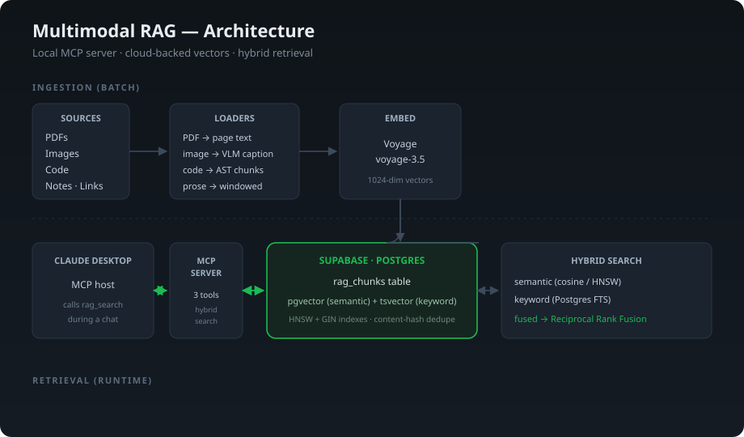

# Multimodal RAG with MCP

A personal knowledge base that an AI assistant can search.



---

## What this is, in plain terms

When you talk to an AI assistant like Claude, it only knows two things: what it learned during training, and what you paste into the conversation. It does not know anything about *your* work — your code, your notes, the documents on your computer, the things you discussed last week.

This project fixes that. It takes a pile of my own material — code from my projects, PDFs, images, and written notes — and organizes it into a searchable knowledge base. Then it connects that knowledge base directly to Claude, so when I ask a question, Claude can look things up in my own files and answer from them instead of guessing.

Think of it like giving the AI a personal filing cabinet, plus the ability to instantly find the right folder in it. Ask "what was the directory path for my portfolio project?" and instead of saying "I don't know," it searches the filing cabinet and answers with the real path from my actual files.

## Why that matters

AI assistants are useful, but they forget. Every conversation starts mostly from scratch, and the AI has no reliable memory of your specific projects. For someone doing real work — writing code, managing projects, building things — that gap is the difference between a tool that gives generic advice and one that knows your actual situation.

Companies are running into this same problem at a much larger scale. As they adopt AI to help their teams, they need the AI to understand *their* internal documents, codebases, and history — not just general knowledge from the internet. This project is a small, working example of exactly that pattern: connecting an AI to a private body of knowledge so its answers are grounded in real, specific information.

## What it can do

- **Search across very different kinds of content at once.** Code, written documents, images, and notes all live in the same searchable place. A single question can pull from any of them.
- **Understand images, not just text.** When an image goes in — a screenshot, a diagram, a chart — the system writes a detailed description of what's in it, so the image becomes findable by searching its contents.
- **Find things by meaning *and* by exact wording.** If I search for a vague concept, it finds related material even if I didn't use the exact words. If I search for an exact function name or error message, it finds that precise match too. (More on why both matter below.)
- **Work directly inside a Claude conversation.** Once connected, Claude can search the knowledge base on its own, mid-conversation, and answer using what it finds.
- **Keep the knowledge base in the cloud.** Indexed content and embeddings live in Supabase, so the database can be reused across machines. Source files and image paths still need to be available to the local ingestion/retrieval environment.

---

## How it works (a level deeper)

The system has two halves: getting information *in*, and getting answers *out*.

### Getting information in (ingestion)

Different kinds of files need different handling, so each type takes its own path:

- **Documents (PDFs, notes)** are split into readable chunks.
- **Code** is split along natural boundaries — each function or class stays whole instead of being cut in half — so a search returns complete, sensible pieces of code.
- **Images** are processed by a local Ollama vision model that writes a rich description of what the image shows. That description is what becomes searchable.
Every chunk is then converted into a list of numbers called an *embedding*, which captures its meaning in a form a computer can compare quickly. All of it gets stored in a database.

### Getting answers out (retrieval)

When a question comes in, the system runs two kinds of search at the same time and combines them:

- **Meaning-based search** finds content that's *about* the same thing, even with different wording.
- **Keyword search** finds *exact* matches — a specific file name, a function, an error string.

Neither alone is enough. Meaning-based search is bad at exact terms; keyword search is bad at concepts. Combining them (a technique called *hybrid search*) covers both, and the results are merged fairly so neither method drowns out the other.

The combined, ranked results get handed back to Claude, which uses them to answer.

### The connection layer

The piece that lets Claude actually *use* all this is an **MCP server** (Model Context Protocol — a standard way to give AI assistants new tools). It exposes the knowledge base to Claude as a set of search tools. Claude decides when to use them, runs a search, gets the results, and answers — all within a normal conversation.

---

## The engineering decisions (for the technically inclined)

These are the choices that separate this from a tutorial clone:

- **Caption-then-embed instead of CLIP-style image embeddings.** The corpus is diagrams, screenshots, and code — content that carries *text* meaning. A vision-model caption embedded as text retrieves better than a visual embedding for this material, and keeps everything in one text vector space. True cross-modal embeddings only earn their complexity for photo-heavy corpora where visual appearance dominates.
- **Structure-aware code chunking.** Python files are split on function/class boundaries using the `ast` module, with the symbol name preserved in metadata. Naive line-window chunking severs functions and wrecks retrieval; symbol names in metadata are also what make exact-identifier keyword search work.
- **Hybrid search via Reciprocal Rank Fusion.** Pure vector search misses exact tokens; pure keyword misses paraphrase. The two are fused with RRF rather than raw-score addition, because cosine distance and `ts_rank` live on different scales and one would otherwise dominate. RRF fuses on rank position, which is scale-free.
- **One database, no separate vector store.** `pgvector` handles semantic search and a generated `tsvector` column handles keyword search, both in Postgres. Reuses infrastructure already in place and removes an entire moving part.
- **Idempotent ingestion.** A content hash plus a unique constraint makes re-running ingestion safe and incremental — already-stored content is skipped, not duplicated.

## Tech stack

| Layer | Choice |
|-------|--------|
| Vector + keyword storage | Supabase (Postgres) with `pgvector` and full-text search |
| Embeddings | Voyage `voyage-3` (1024-dim) |
| Image captioning | Ollama `qwen2.5vl:3b` (local vision model) |
| AI connection | MCP server (Python, FastMCP) |
| Language | Python |
## Project layout

```
sql/01_schema.sql                 table: pgvector + generated tsvector + indexes
sql/02_search_fns.sql             semantic / keyword / hybrid (RRF) search functions
ingest/core.py                    config, embedding, image captioning, database writes
ingest/loaders/code_loader.py     structure-aware code chunking
ingest/loaders/doc_loaders.py     pdf / image / note / link loaders
ingest/ingest.py                  ingestion command-line tool
ingest/retrieval.py               semantic / keyword / hybrid search
server.py                         MCP server exposing search to Claude
```

## Setup

1. **Database.** Run `sql/01_schema.sql` then `sql/02_search_fns.sql` in Supabase.
2. **Keys.** Copy `.env.example` to `.env` and fill in your Supabase and Voyage credentials. Image captioning runs locally through Ollama.
3. **Install.** `python -m venv .venv && source .venv/bin/activate && pip install -r requirements.txt`

## Use

Ingest content:
```bash
python ingest/ingest.py path  ~/projects/my-repo     # a whole folder
python ingest/ingest.py file  ~/docs/spec.pdf        # a single file
python ingest/ingest.py link  https://example.com    # a web page
```

Test a search directly:
```bash
python ingest/retrieval.py "how does the login flow work"
```

Connect to Claude Desktop by adding the server to its config (see `claude_desktop_config.example.json`), then restart it. The MCP server exposes `rag_search`, `rag_search_typed`, and `rag_get_image` for grounded search and image retrieval.
## Honest notes

- **On "token savings":** retrieval reduces tokens only versus a baseline of pasting large context by hand. Against careful, surgical pasting it mostly buys better *recall*, not cheaper conversations. The real value is accurate grounding across a scattered body of work, not a headline percentage.
- **Conversations:** there is no live feed of chat history into the knowledge base; conversations must be exported to text and ingested like any other document.
- **Cost:** embeddings use Voyage API credits; image captioning runs locally through Ollama, so there is no per-image vision API charge.
## License

MIT — see [LICENSE](LICENSE).
